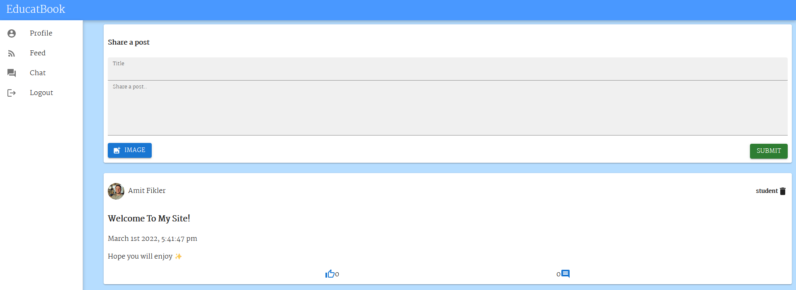
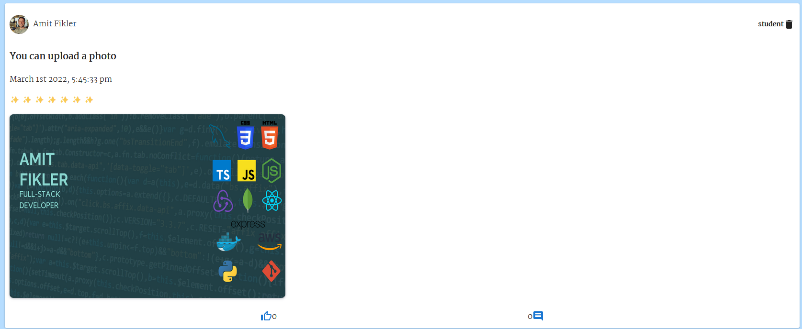
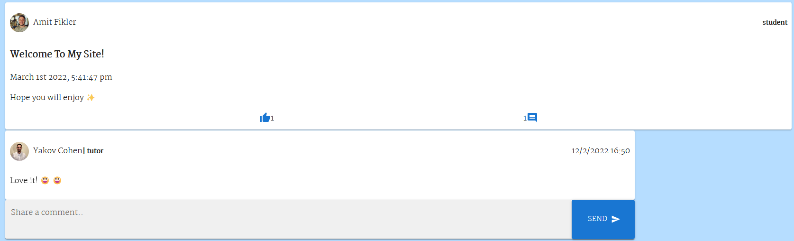
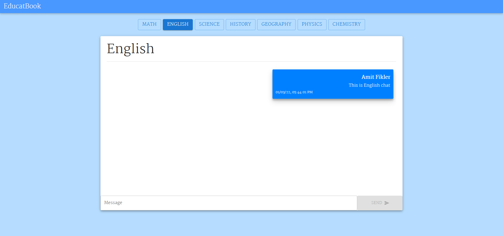

# Educatebook 📖

A social network of tutors and students.  
On this site you can search for private tutors, tutors will be able to advertise themselves, and can talk live on study topics in the chat rooms

---

### Technologies in use - 👩‍💻👨‍💻

- _[React](https://reactjs.org/) - For the frontend_
- _[NodeJs](https://reactjs.org/) - For the backend_
- _[TypeScript](https://www.typescriptlang.org/) - As a programming language_
- _[React Router DOM](https://www.npmjs.com/package/react-router-dom) - To create single page app_
- _[Docker](https://www.docker.com/) - For global use_
- _[Socket.io](https://socket.io/) - For live connection_
- _[MongoDB](https://www.mongodb.com/) - As a Database_
- _[Cloudinary](https://cloudinary.com/) - To store photos_
- _[jest & supertest](https://www.npmjs.com/package/supertest) - For integration tests_

#### Packages 📦

##### Front-end

- _[Axios](https://www.npmjs.com/package/axios) - For API requests_
- _[React-toastify](https://fkhadra.github.io/react-toastify/introduction) - for nice popUp messages_
- _[Socket.io-client](https://socket.io/docs/v4/client-api/) - For client server connection_
- _[Moment](https://momentjs.com/) - For nice dates_
- _[React](https://mui.com/) - For design_
- _[Material icons](https://mui.com/components/material-icons/) - For icons_

##### Back-end

- [ts-node-dev](https://www.npmjs.com/package/ts-node-dev) and [ts-node](https://www.npmjs.com/package/ts-node)
- [Express](https://www.npmjs.com/package/express)
- _[Socket.io](https://socket.io/) - For client server connection_
- [Cors](https://www.npmjs.com/package/cors)
- _[JWT](https://jwt.io/) - To generate tokens_
- _[Bcrypt](https://www.npmjs.com/package/bcrypt) - To encrypt passwords_
- _[Jest](https://jestjs.io/docs/) - For testing_
- _[Supertest](https://www.npmjs.com/package/supertest) - For testing_
- _[mongoose](https://mongoosejs.com/) - As ORM_
- _[Cloudinary](https://cloudinary.com/) - For store images_
- _[validator](https://www.npmjs.com/package/validator) - For validation_
- _[dotenv](https://www.npmjs.com/package/dotenv) - For environment variables_

---

## App -

## Public use -

#### Link to docker hub- [Docker Hub](https://hub.docker.com/repository/docker/amitfikler/educatebook) 🐋

#### Link to heroku- [Heroko](https://educatebook.herokuapp.com/login) ⭐

## Local use -

- _Clone this repo_
- _Run `npm i` on the `frontend` and `backend` dirs - To install all the dependencies_
- _Run `npm run dev` on `backend` dir - To start the server_
- _Run `npm start` on `frontend` dir - To start the front-end_
- _Go to http://localhost:3000 and enjoy!_

## Docker 🐋
- _Run `docker-compose up`_

<!-- - _Docker - Run on root dir `docker build -t chat-app .` ➡ `docker run -dp 4000:4000 chat-app`_
- _Docker compose - Run on root dir `docker-compose up -d --build`_
- _Go to http://localhost:4000 and enjoy!_ -->

---

## Features - 💫

### Login and Register

- _Login and register with a unique username and password_ 👤
- _User can add a profile picture_ 🤳
- _if user enter wrong details, jump toast message_ 💡

### Feed

- _User can upload a post_ 📝
- _User can upload a post with picture_ 📝🏞️
- _User can leave a comment for posts_ 🗨️
- _User can like a post_ 👍
- _User can delete his own posts_ 🗑️

### Chat

- _Getting all your messages history_ 📅
- _Dedicated rooms for each subject_ 💬 🗨️
- _Nice design!_ 💅

---

## Future Plans 📅👩‍🚀

- _Search - Search messages and users 🔎_
- _Users profile 👥_
- _Rating for tutors_ ⭐⭐
- _Hashtags_ #️⃣

---

# Screenshots 📸 -

## Login and register 🔐

## Feed 📝

## Chat 💬 🗨️

